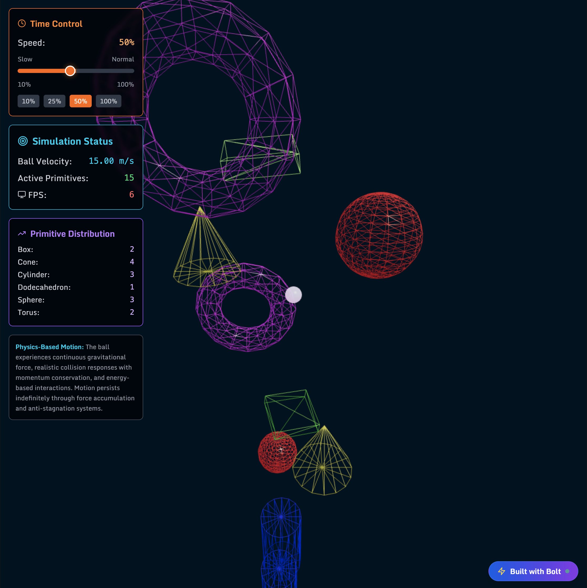

# Rube Goldberg 3D Simulation

> An infinite, unique experience through digital art - a Rube Goldberg's absurdist mechanics simulation using simple 3D shapes in space.
>
> 
<!-- Create visual badges -->

  
  

## 📸 Demo

  <a href="https://www.youtube.com/watch?v=U_MRRu9B1zo">
    
     
    ▶️ Click to watch demo
  </a>

## 🎯 Inspiration

Creating an infinite, unique experience through a digital art piece that captures the whimsical nature of Rube Goldberg machines in a digital space.

## ✨ What it does

This project presents a Rube Goldberg's absurdist mechanics simulation using simple 3D shapes in space. The simulation creates an endless, mesmerizing experience reminiscent of classic computer screensavers, with objects interacting in unexpected and delightful ways.

## 🔧 How I built it

The development process involved several key steps:

- **Ideation**: Used Claude to brainstorm the initial concept and explore possibilities
- **Scope Management**: Carefully limited the scope after thoughtful consideration to ensure a focused, deliverable product
- **Development**: Leveraged Cursor for debugging to optimize development efficiency and save tokens
- **3D Implementation**: Built the simulation using Three.js for 3D graphics and physics

## 🚧 Challenges I ran into

This project represented my third attempt to get a working product, highlighting the iterative nature of creative coding:

- **API Issues**: Some APIs were not behaving properly during development
- **Technical Limitations**: As someone who isn't deeply technical, debugging proved challenging
- **Problem-Solving**: Started a new chat in Bolt after getting stuck on a persistent problem, demonstrating the importance of fresh approaches

## 🏆 Accomplishments that I'm proud of

Successfully created a fun, engaging simulation that evokes nostalgia for the screensavers of early computers. The project captures that same mesmerizing quality that made people stop and watch their screens.

## 📚 What I learned

**Coding is addictive, especially when you have tools like Bolt.** This project reinforced the joy of creative coding and the power of modern development tools to make programming more accessible.

## 🔮 What's Next

Currently working on another visualization focused on **the study of anticipation** - exploring how we can represent and interact with the concept of expectation in digital space.

## 🛠️ Built With

- **[Bolt](https://bolt.new)** - Development environment
- **[Claude](https://claude.ai)** - AI assistance for ideation and problem-solving
- **[Cursor](https://cursor.sh)** - Code editor and debugging
- **[Three.js](https://threejs.org)** - 3D graphics library

## 🚀 Try it out

Experience the simulation at [bolt.new](https://bolt.new)

---

*This project explores the intersection of digital art, physics simulation, and nostalgic computing experiences.*
